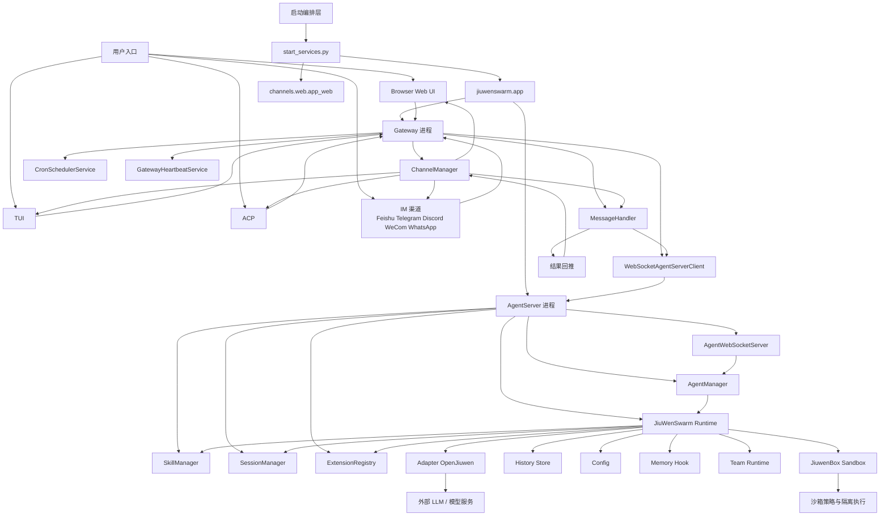
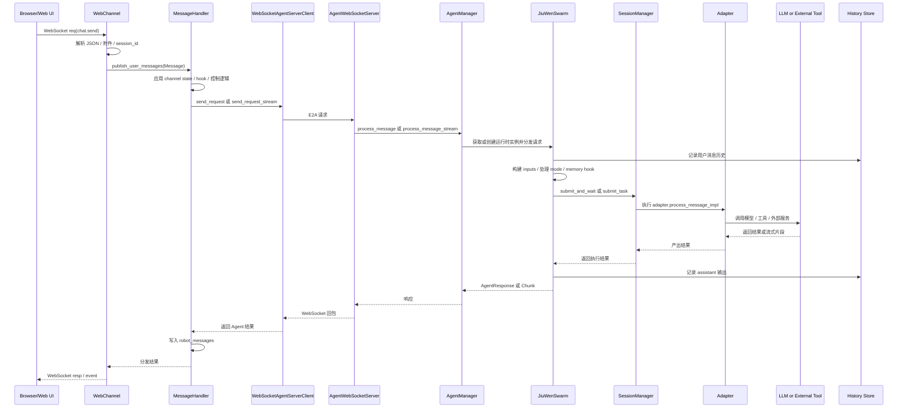

# JiuwenSwarm 项目整体架构分析

## 1. 项目定位

该仓库是一个以 `jiuwenswarm` 为核心的多入口 Agent 平台，主要提供以下能力：

- 多种交互入口：Web、TUI、ACP，以及多种 IM 渠道
- 双进程后端：`Gateway` 负责接入和路由，`AgentServer` 负责实际 Agent 执行
- 多模式 Agent 运行时：普通对话、代码模式、Team 模式、技能模式、定时任务等
- 可扩展能力：扩展系统、技能管理、记忆、心跳、Cron、Sandbox
- 独立沙箱子项目：`jiuwenbox`

## 2. 顶层结构

```text
/workspace
|- jiuwenswarm/           主业务代码
|  |- channels/           Web / TUI / ACP / Desktop 接入层
|  |- gateway/            消息接入、路由、心跳、Cron、渠道管理
|  |- server/             AgentServer、会话、运行时、技能、沙箱接入
|  |- agents/             Agent 组装、团队协作、工具与运行规则
|  |- common/             配置、协议、通用模型、安全与工具
|  |- extensions/         扩展加载与扩展注册
|  |- symphony/           检索、索引、技能检索相关子系统
|  |- resources/          默认配置与工作区模板
|- jiuwenbox/             独立沙箱服务
|- docs/                  中英文文档
|- tests/                 单元、集成、系统、UI E2E 测试
|- scripts/               构建、打包、部署脚本
```

## 3. 核心分层说明

### 3.1 启动编排层

- `jiuwenswarm.start_services`
  - 统一启动入口
  - 负责按模式启动 `app`、`web`、`dev`
- `jiuwenswarm.app`
  - 二次编排后端核心进程
  - 拉起 `AgentServer` 与 `Gateway`

### 3.2 接入层

- `jiuwenswarm/channels/web`
  - Web 页面静态服务与前端工程
- `jiuwenswarm/gateway/channel_manager/web`
  - WebSocket 接入，将前端请求转成内部消息
- `jiuwenswarm/channels/tui`
  - TUI 前端
- `jiuwenswarm/channels/acp`
  - ACP 通道接入
- `jiuwenswarm/gateway/app_gateway.py`
  - 还会挂载第三方 IM 渠道，例如 Feishu、Telegram、Discord、WeCom、WhatsApp 等

### 3.3 Gateway 层

Gateway 的职责是接入、治理和转发，而不是执行 Agent：

- 初始化扩展系统
- 连接 `AgentServer`
- 启动 `MessageHandler`
- 初始化 `CronSchedulerService`
- 初始化 `HeartbeatService`
- 维护 `ChannelManager`
- 为 Web/TUI/ACP/IM 提供统一消息入口

### 3.4 AgentServer 层

AgentServer 是运行时执行中心，负责：

- 对外提供 WebSocket 服务
- 接收 Gateway 发来的标准请求
- 根据 `channel + mode + project_dir` 获取或创建 Agent 实例
- 管理会话串行与并发
- 调用底层 Adapter 和 LLM
- 写入历史记录、执行记忆 Hook、技能管理与团队模式逻辑
- 按需接入 `jiuwenbox` 沙箱

### 3.5 Runtime 层

核心运行时在 `jiuwenswarm/server/runtime`：

- `agent_manager.py`
  - Agent 实例缓存与生命周期管理
- `agent_adapter/interface.py`
  - `JiuWenSwarm` 运行时门面
- `session/session_manager.py`
  - 控制同一 session 串行、不同 session 并发
- `skill/skill_manager.py`
  - 技能启停、安装、市场与检索管理

### 3.6 数据与基础设施层

- 配置：`config/config.yaml`
- 会话历史：`agent/sessions/<session_id>/history.json`
- 定时任务：Gateway Cron Store
- 技能与市场状态：Skill Manager 管理
- 扩展与 Hook：Extension Registry / Manager
- 沙箱：`jiuwenbox`
- 外部模型与服务：OpenJiuwen、各类 LLM Provider、第三方 IM 平台

## 4. 整体架构图



## 5. 核心调用主链

最典型的一条主链是 Web 前端发起对话：

1. 浏览器通过 WebSocket 向 Gateway 的 Web Channel 发送请求
2. Web Channel 将请求解析为内部 `Message`
3. `MessageHandler` 将消息转发给 `AgentServerClient`
4. `AgentServer` 收到请求后交给 `AgentManager`
5. `AgentManager` 获取对应 `JiuWenSwarm` 实例
6. `JiuWenSwarm` 组装输入、写入历史、触发记忆 Hook，并调度底层 Adapter
7. Adapter 与模型或外部工具交互
8. 结果从 `AgentServer` 回传到 `Gateway`
9. `Gateway` 再由 `ChannelManager` 推送给浏览器

## 6. 调用时序图



## 7. 关键入口文件

- 启动器：`jiuwenswarm/start_services.py`
- 后端双进程编排：`jiuwenswarm/app.py`
- Gateway 入口：`jiuwenswarm/gateway/app_gateway.py`
- AgentServer 入口：`jiuwenswarm/server/app_agentserver.py`
- Web Channel：`jiuwenswarm/gateway/channel_manager/web/web_connect.py`
- Gateway 转发核心：`jiuwenswarm/gateway/message_handler/message_handler.py`
- 运行时门面：`jiuwenswarm/server/runtime/agent_adapter/interface.py`
- Agent 实例管理：`jiuwenswarm/server/runtime/agent_manager.py`
- 会话管理：`jiuwenswarm/server/runtime/session/session_manager.py`
- 沙箱：`jiuwenbox/src/jiuwenbox/server/app.py`

## 8. 架构结论

该项目采用了比较清晰的分层式和双进程解耦设计：

- 接入与路由放在 Gateway
- 执行与会话控制放在 AgentServer
- 前端与多渠道统一走标准消息模型
- 复杂模式能力通过 Runtime、Skill、Extension、Team、Sandbox 进行横向扩展

这种设计的优点是：

- 渠道接入和 Agent 执行职责分离
- 便于扩展新的 Channel 或 Agent 模式
- 便于把会话、技能、心跳、定时任务分别治理
- 后续可以继续向多实例、分布式 Team、远程沙箱演进
