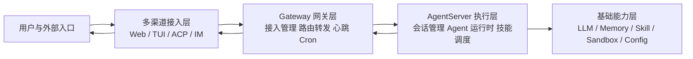
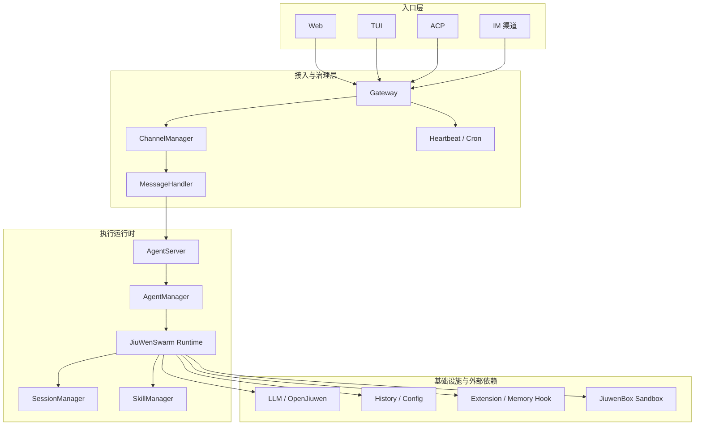

# JiuwenSwarm 项目整体架构图 PPT 版

## 1. 一页汇报版

适合在汇报首页直接展示，强调系统分层与主数据流。

## 2. PPT 风格精简架构图

适合放在“系统架构设计”页，保留关键模块，不展开实现细节。

## 3. 汇报时推荐讲法

- 第一层是多渠道入口，统一接入不同终端与第三方平台
- 第二层是 Gateway，负责治理、路由和统一协议转换
- 第三层是 AgentServer，负责真正的 Agent 执行与会话控制
- 第四层是基础能力，包括模型、记忆、技能、配置与沙箱
- 整体设计实现了“接入解耦执行、渠道解耦运行时”的分层治理

## 4. 适合放在 PPT 上的精简结论

- 架构模式：双进程解耦，Gateway 与 AgentServer 职责清晰
- 接入能力：支持 Web、TUI、ACP 与多 IM 渠道统一接入
- 运行能力：支持会话管理、技能调度、团队模式和流式响应
- 扩展能力：通过 Extension、Skill、Sandbox 实现横向扩展
- 演进方向：可进一步支持多实例、分布式 Team、远程执行环境

## 5. 评审版一句话摘要

JiuwenSwarm 采用“多渠道统一接入 + Gateway 治理转发 + AgentServer 执行运行时 + 基础能力解耦支撑”的分层架构，兼顾接入扩展性、运行时治理能力和后续分布式演进空间。
